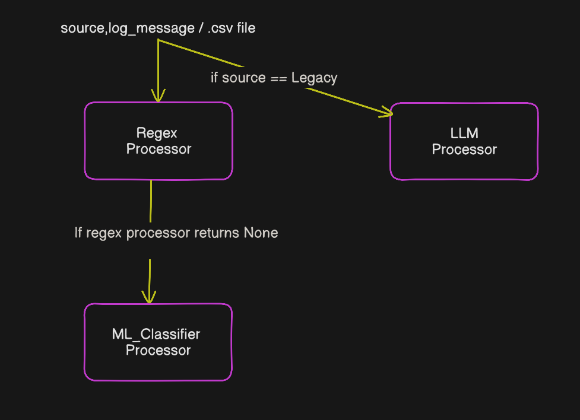

# Log-Classification-Hybrid-Framework

A hybrid log classification framework that combines regex heuristics, machine learning, and an LLM path for source-specific log analysis.

## Features

- Classify log entries from CSV or single JSON payloads
- Hybrid decision pipeline:
  - regex matching first
  - ML classifier fallback
  - LLM classification for legacy sources
- FastAPI interface for production-ready API usage
- Modular architecture for maintainable classification logic

## How it works

1. Incoming log data is received through either the CSV endpoint or the single-log endpoint.
2. Each log entry is routed by source:
   - `LegacyCRM` logs are classified using the LLM processor (There wasn't not enought data with source type `LegacyCRM` to train the ML model. That's the only reason we are using a LLM here.)
   - all other sources are first evaluated by the regex processor
   - if regex produces no label, the ML classifier is used as a fallback
3. The classification result is returned to the caller or written back to a new CSV.

### Architecture




The code is intentionally separated into:

- `classify.py` — core classification orchestration and CSV helper functions
- `api.py` — FastAPI application exposing the classification endpoints
- `processor_regex.py` — regex-based label extraction
- `processor_ml_clf.py` — model-based fallback classification
- `processor_llm.py` — LLM-powered legacy source classification

## Setup

1. Create and activate a virtual environment:

```bash
python -m venv venv
venv\Scripts\Activate.ps1
```

2. Install dependencies:

```bash
pip install -r requirements.txt
```

## Usage

### Run the API

```bash
uvicorn api:app --reload
```

### Classify a CSV file

Send a `POST` request to `/classify-csv` with a CSV file upload. The CSV must contain:

- `source`
- `log_message`

### Classify a single log entry

Send a `POST` request to `/classify-log` with JSON:

```json
{
  "source": "ModernCRM",
  "log_message": "User 12345 logged in."
}
```

## Example

A successful `/classify-log` response looks like:

```json
{
  "label": "security_alert"
}
```

A successful `/classify-csv` response returns JSON records with a `target_label` field added.

## Project structure

- `api.py` — FastAPI app and endpoint definitions
- `classify.py` — classification orchestration and CSV helpers
- `processor_regex.py` — regex rules for log classification
- `processor_ml_clf.py` — machine learning classifier wrapper
- `processor_llm.py` — LLM classification wrapper
- `resources/test.csv` — sample log dataset for quick testing
- `models/log_clf.joblib` — trained ML classifier artifact

## Notes

- Keep the CSV schema consistent for reliable classification.
- Use the `resources/test.csv` file for local validation.
- The architecture supports adding new processors easily by extending the routing logic in `classify_log`.
